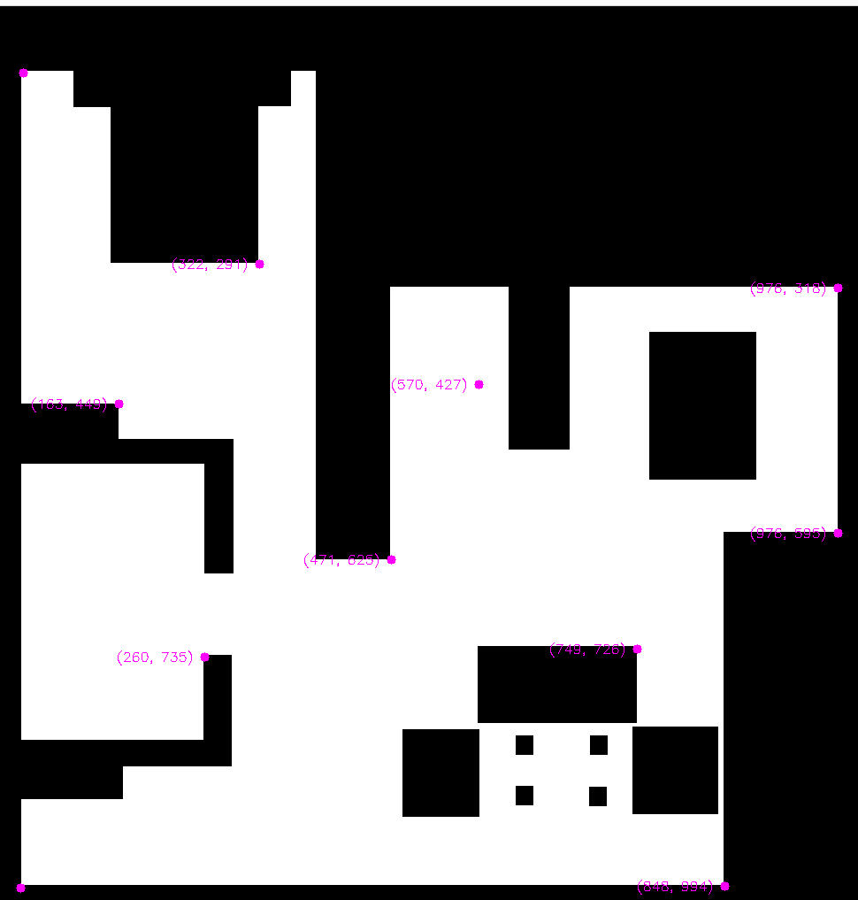
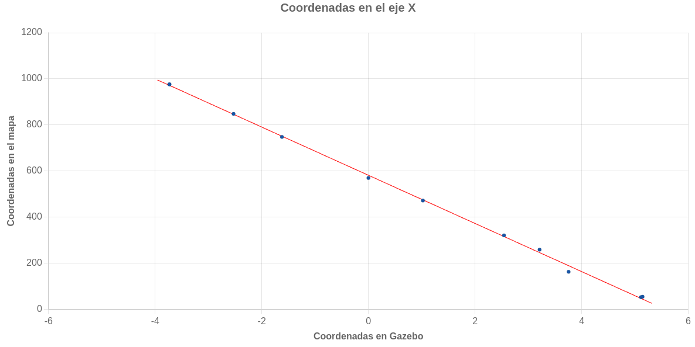
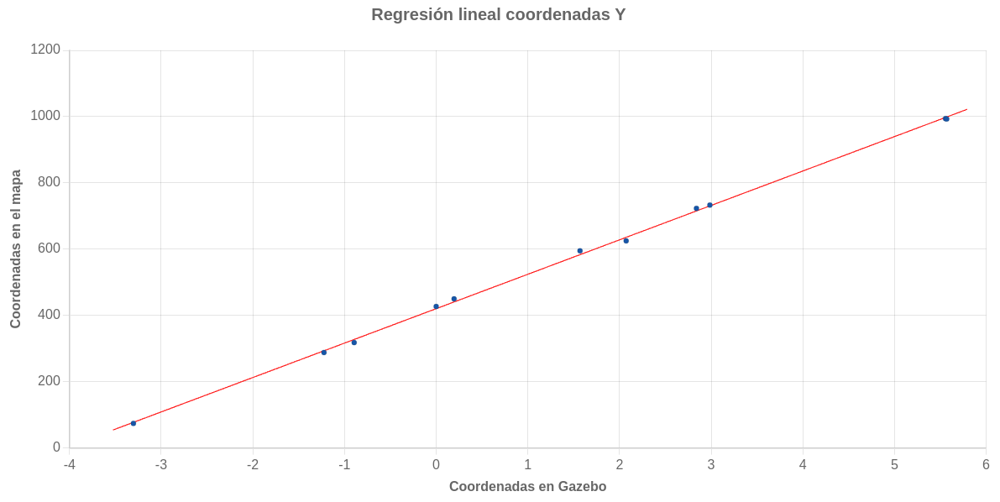

## Objetivos :

El objetivo de esta práctica es programar un robot aspiradora capaz de autolocalizarse para hacer más eficiente su algoritmo y limpiar así la casa
en menos tiempo usando el algoritmo BSA de cobertura

## BSA :

El algoritmo BSA _(Backtracking Spiral Algorithm)_ es un algoritmo de cobertura para robots móviles basado en el uso de una espiral (o barrido en este caso), que completa toda una zona antes de pasar a la siguiente, asegurando así la cobertura de todo el escenario.

Hay una serie de puntos a tener en especial consideración:
- Puntos críticos: Aquellos puntos cuyas celdas contiguas han sido todas visitadas,
- Puntos de retorno: Son los puntos no visitados más cercanos al punto crítico.
- Obstáculos: Puntos por los que no puede pasar el robot
- Casillas libres: Las casillas por las que pasa el robot

Con este algoritmo, el robot recorrerá la zona pasando a una casilla adyacente cada vez y al encontrarse en un punto crítico, encontrará el camino más corto al punto de retorno más cercano.

Un ejemplo la ejecución de este algoritmo es el siguiente:

<iframe src="https://jumpshare.com/embed/8ntvBXXYcdfrKgIe9kpd" frameborder="0" webkitallowfullscreen mozallowfullscreen allowfullscreen style="position: absolute; top: 0; left: 0; width: 100%; height: 100%;"></iframe>

## Principales Problemas :

### Relación entre el mapa y el mundo

Lo primero a tener en cuenta es como pasar de las coordenadas en el mundo, al pixel del mapa y viceversa. Una forma de encontrar esta relación es obteniendo los mismos puntos en ambos dominios, y relacionandolos mediante regresión lineal. 
Para hacer esto usé un programa muy simple para mostrar en opencv el pixel que seleccionaba en el mapa y obtenía las coordenadas moviendo el robot a ese mismo punto y obteniendo su posición. 

Estos son los puntos elegidos:

Usando una calculadora web de regresión lineal, obtenemos las siguientes rectas y sus ecuaciones:

Usando estas ecuaciones podemos trasladar las coordenadas en gazebo al pixel correspondiente en el mapa, y, despejando, obtenemos la misma operación en sentido contrario.

### Desarrollo del algoritmo

Aunque el algoritmo BSA es sencillo conceptualmente, al implementarlo pueden aparecer ciertos problemas. 
Lo primero es dividir el mapa en celdas, formando una rejilla, en mi caso, para facilitar la visualización, creo una rejilla con los valores de cada celda, y otra del mismo tamaño que el mapa para visualizar la primera por colores.

También es importante relacionar cada pixel del mapa con la celda correspondiente de la rejilla. Para ahorrarme iteraciones, mi rejilla empieza en la esquina superior izquierda de la casa, ahorrandome el espacio en blanco tras este punto.

Además, para asegurarme que la siguiente celda es siempre adyacente al robot, y no una anterior, asigno un coste máximo, igual al número de celdas, a las primeras celdas vecinas que encuentra, en las siguientes iteraciones, el coste va disminuyendo, de forma que las últimas celdas vecinas descubiertas siempre tendrán menor coste que las anteriores. Aunque una celda vecina ya haya sido vista, si el robot pasa a una celda adyacente y siempre que el robot no haya pasado por ella, podrá actualizarla, asignándole menor coste.

### Regreso a un punto de retorno

Para encontrar el camino más corto de un punto crítico al punto de retorno más cercano, he decidido usar un algoritmo de búsqueda BFS, que consiste en buscar desde las celdas más cercanas a las más alejadas. Dado que tuve que implementar este algoritmo en otras asignaturas y es similar a la implementación de BSA, su desarrollo no fue excesivamente costoso.

### Movimiento del robot entre celdas

En un primer momento quise desarrollar una función con la que el robot se desplazase a una de las celdas adyacentes, pero dado que controlar el angulo de giro es complicado a no ser que sea reactivo, decidí cambiar la aproximación e implementar el movimiento usando las coordenadas en Gazebo, reciclando código que desarrollé en la asignatura de Robótica Móvil. 
Por ello, decidí usar VFF para el movimiento del robot, ya que las celdas están muy cerca entre sí y hay bastante margen entre los obstáculos reales y las casillas marcadas como obstáculos, no ha sido necesario implementar el láser para que esquive obstáculos, por lo que el robot se mueve en línea recta a la celda de destino.

## Video demonstración